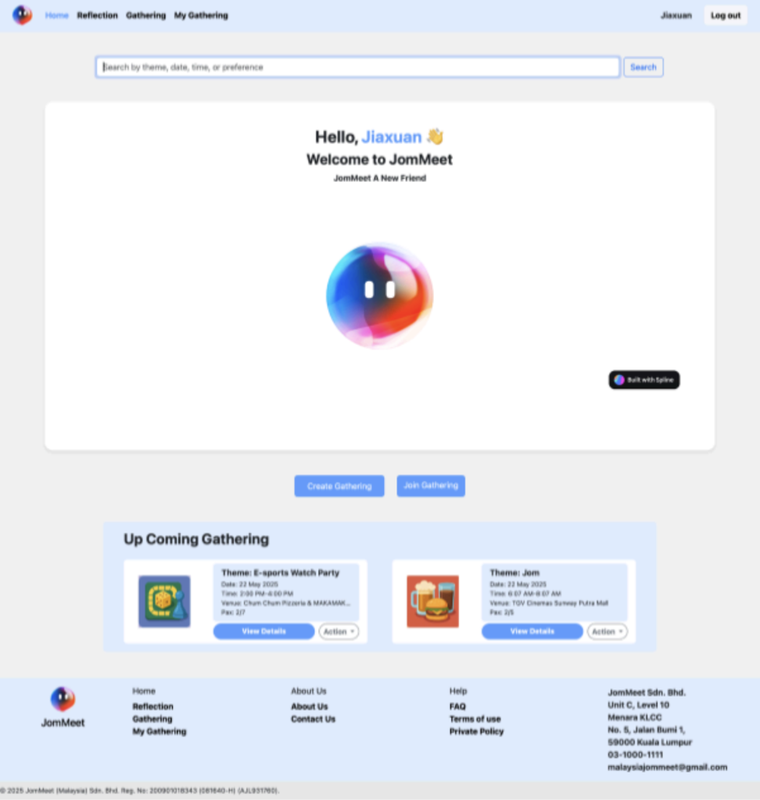
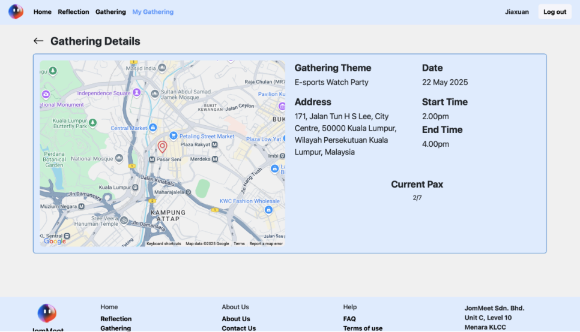
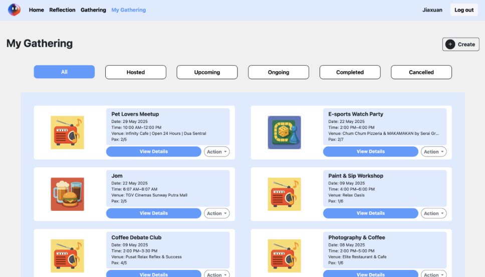
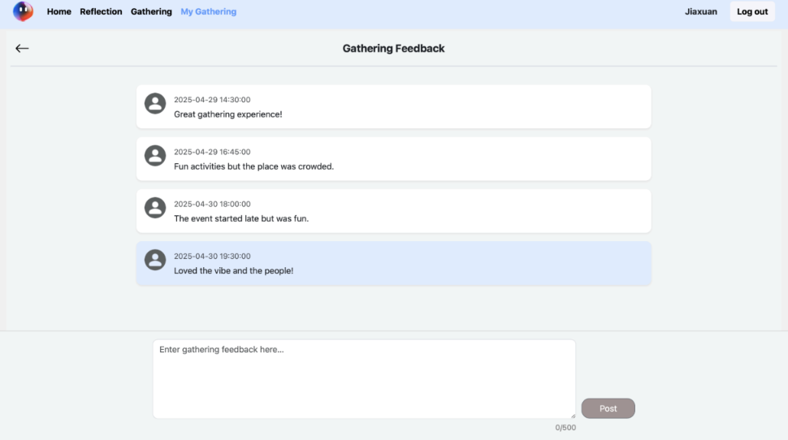

## Project Title

# JomMeet

## Overview

JomMeet is a PHP/MySQL social meetup web application for organizing small in-person gatherings.

It provides a structured system for discovering, joining, hosting, and managing social events, combining participation rules, reminders, and post-event reflection into a cohesive coordination workflow.

## Project Value

- Demonstrates practical application of layered backend architecture in a full request lifecycle.
- Shows domain modeling across users, gatherings, participation, feedback, reminders, and reflections.
- Highlights flow-based reasoning for join/leave eligibility, host actions, and state transitions.
- Integrates external services (Maps/Places and WhatsApp messaging) into core product workflows.
- Reflects end-to-end understanding from routing and business logic to persistence and UI behavior.
- Demonstrates end-to-end reasoning across request flow, domain rules, and persistence behavior in a layered system.

## Key Features

- Supports phone-based login and onboarding with profile creation for new users.
- Manages profile data including MBTI, hobbies, and gathering preferences.
- Provides gathering discovery, search, eligibility filtering, and join behavior.
- Supports host lifecycle operations: create, edit, and cancel with rule checks.
- Includes a My Gathering dashboard with categorized tabs and reminder threads.
- Provides participant and host feedback workflows for gatherings and locations.
- Supports self-reflection CRUD for post-event personal records.
- Runs automatic gathering status transitions through a background worker.
- Integrates Google Maps / Places for location lookup and selection.
- Integrates Infobip WhatsApp templates for key gathering notifications.

## Screenshots

### Dashboard / Home


### Gathering Detail


### My Gathering


### Gathering Feedback


## Architecture

JomMeet uses a custom layered PHP architecture:

- **Front controller**: `app/public/index.php`
- **Router engine**: `app/Route.php`
- **Route registry**: `app/web.php`
- **Controllers**: handle requests and select response views
- **Models**: enforce business rules and orchestrate domain logic
- **DAOs**: execute SQL operations through PDO

Request execution follows a front-controller routing pattern, then flows through controller → model → DAO → database layers.

```text
HTTP Request
  -> app/public/index.php
  -> app/autoload.php
  -> app/Route.php
  -> app/web.php
  -> Route::dispatch()
  -> Controller action
  -> Model business logic
  -> DAO (PDO SQL)
  -> MySQL
  -> Controller includes View
  -> HTTP Response
```

## Tech Stack

### Backend

- PHP
- Custom routing and layered architecture
- PDO for database access
- Composer for dependency management

### Frontend

- Server-rendered PHP views
- Bootstrap 5
- jQuery
- Custom JavaScript modules for form validation and UI interactions

### Infrastructure and Runtime

- MySQL / MariaDB
- PHP built-in server for local development
- Optional XAMPP-based local setup

### Integrations

- Google Maps JavaScript API
- Google Places API
- Infobip WhatsApp API

## Project Structure

```text
JomMeet_Base/
├── app/
│   ├── Presentation/
│   │   ├── Controller/
│   │   └── View/
│   ├── BusinessLogic/
│   │   ├── Model/
│   │   └── Service/
│   ├── Persistence/
│   │   └── DAO/
│   ├── public/
│   ├── bin/
│   ├── Route.php
│   ├── web.php
│   ├── autoload.php
│   └── Database.php
├── jommeet.sql
└── README.md
```

## Database Overview

Main schema is provided in `jommeet.sql`, organized by functional domain:

- **User profile domain**
  - `profile`
  - `profile_hobby`
  - `profile_preference`
- **Gathering domain**
  - `gathering`
  - `location`
  - `profilegathering`
- **Engagement domain**
  - `feedback`
  - `reminder`
- **Reflection domain**
  - `self_reflect`

## Local Setup

1. Ensure prerequisites are installed:
   - PHP 8+
   - MySQL / MariaDB
   - Composer
2. Import the database:
   - Import `jommeet.sql` into your local MySQL server.
3. Update database configuration in `app/Database.php`:
   - Host, database name, username, and password.
4. Install dependencies (if not already installed):
   ```bash
   cd app
   composer install
   ```
5. Start the local web server from `app/`:
   ```bash
   php -S localhost:8000 -t public
   ```
6. Open the app:
   - `http://localhost:8000`
7. (Optional) Run the background worker from `app/bin/`:
   ```bash
   php checkGathering.php
   ```

## Contribution Scope

This project is presented as a focused engineering contribution within a layered PHP application.  
Contribution ownership can be described across the following areas:

- Responsible for gathering lifecycle behavior (discovery, join, leave, and host actions).
- Responsible for host management flows (create/edit/cancel) with validation and state checks.
- Responsible for reminders and feedback workflows tied to participation rules.
- Responsible for tracing and documenting end-to-end request flow from routing to persistence.
- Responsible for debugging and refining controller/model/DAO boundaries and runtime behavior.
- Responsible for architecture-level analysis across modules and domain flows.

This work required consistent coordination across routing, domain logic, persistence, and UI behavior, with a clear understanding of full request flow and business-rule execution.

## Design Considerations

- Structured the codebase with clear separation between request handling, domain logic, and data access.
- Chose server-rendered views with light JavaScript to keep interaction responsive without heavy frontend complexity.
- Centralized domain validation in model/service layers before any persistence operations.
- Added a worker process for deterministic time-based gathering state transitions.
- Integrated maps and messaging services at workflow boundaries where they directly improve user coordination.

## Limitations

- Current authentication flow stores and compares plaintext passwords.
- CSRF protection is not visibly implemented across state-changing forms.
- Some configuration and secret values are hardcoded in the current codebase.
- A few code paths are partial/legacy and include inconsistent references.
- Full local functionality depends on external service availability (Maps/Places and Infobip).

## Future Improvements

- Implement password hashing and verification (`password_hash` / `password_verify`).
- Add CSRF protection to all mutating form/API endpoints.
- Move secrets and environment-specific settings into environment-based config.
- Tighten authorization checks across edit/delete flows and edge cases.
- Refactor large controller/model files into smaller focused components.
- Expand automated testing for request flow, business rules, and DAO behavior.

